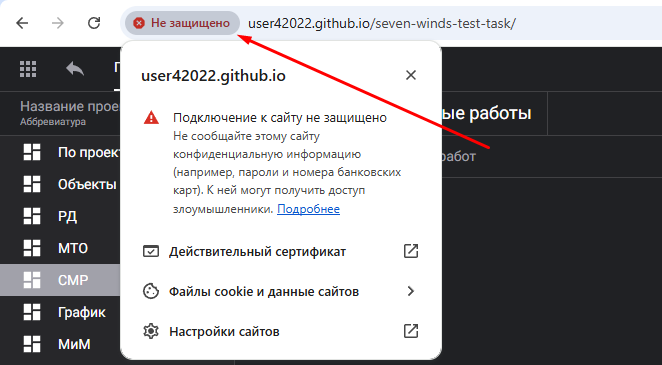
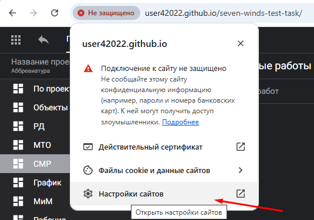
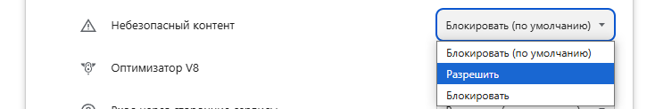
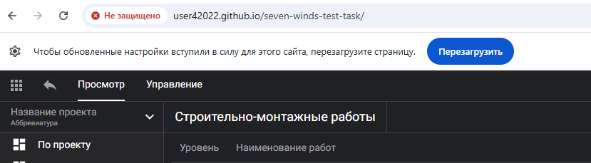

## [Описание тестового задания](https://knowing-owner-ff2.notion.site/555cdc7bcd274c47a2d9fb9e84a84db7)

## [Code style](https://rikzun.notion.site/Code-style-and-Best-Practices-9d5beaa4adf14743bf34ea6bb0c213eb#859814c79da547f6ae5f9a45f92e4c7e)
Внимание! Взаимодействие с API  идет через http протокол. Возникает ошибка Mixed content и получать данные невозможно. Для отображения данных на github pages можно отключить блокировку для этого сайта у себя в браузере.
Ниже пример для  Google Chrome:

- Нажать на иконку слева от адресной строки

- Выбрать опцию "Настройки сайтов"

- Для опции  "Небезопасный контент" установить значение "Разрешить"

- Перезагрузить сайт

